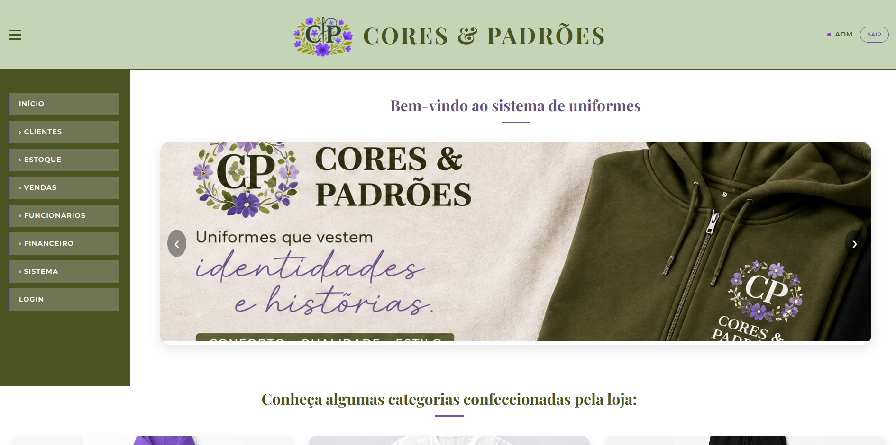

sistema-uniformes-ifsc

📁 Sistema de Gerenciamento de Uniformes

Um sistema web completo para gerenciamento de vendas, estoque e organização administrativa de uma loja digital de uniformes. Desenvolvido como projeto prático por estudantes do IFSC Campus Chapecó.

🚀 Sobre o Projeto

O Sistema de Uniformes é uma aplicação web interativa desenvolvida para solucionar os problemas reais de gerenciamento de uma loja de uniformes totalmente digital. Uma plataforma automatizada para o controle de estoque, registro de vendas, cadastro de clientes e acompanhamento administrativo.
Este projeto foi construído sob medida dentro do ambiente acadêmico, aplicando conceitos de engenharia de software, modelagem de banco de dados (DER), casos de uso e metodologias ágeis (Scrum) no cenário real do mercado de uniformes padronizados.

🛠️ Tecnologias e Recursos Utilizados

O ecossistema do projeto foi construído integrando tecnologias consolidadas para desenvolvimento full-stack responsivo e gerenciamento ágil: 

- HTML5 & CSS3: Estruturação semântica e estilização da interface gráfica.
- JavaScript (ES6): Lógica de programação no front-end para filtros de pesquisa e melhorias de usabilidade.
- PHP: Linguagem back-end robusta responsável pelas regras de negócio, autenticação e comunicação com o servidor.
- MySQL: Banco de dados relacional para persistência de dados de vendas, clientes, funcionários e estoques.
- DBDesigner 4: Ferramenta utilizada para a modelagem do diagrama Entidade-Relacionamento (ER).
-  Metodologia Scrum: Divisão de tarefas em Sprints, reuniões de alinhamento e acompanhamento contínuo da equipe.

⚙️ Funcionalidades (CRUD e Administrativo)

O sistema conta com níveis de acesso (Administrador, Funcionário e Cliente)  e engloba as seguintes operações fundamentais: 

- Controle de Estoque: Cadastro e atualização de produtos, quantidades disponíveis e valores unitários, com baixa automática ao registrar uma venda.
- Registro e Histórico de Vendas: Mapeamento completo de transações, incluindo identificação do produto, cliente, data, valor, descontos e formas de pagamento (à vista ou a prazo).
- Cadastro de Clientes e Funcionários: Módulos de CRUD completos para gerenciar as informações pessoais dos compradores e do corpo técnico.
- Painel e Relatórios Administrativos: Telas exclusivas para o gerenciamento de permissões de login, consulta do fluxo de caixa e emissão de relatórios de estoque e vendas.

📊 Arquitetura e Modelagem do Sistema

Fluxo de Eventos Principal (Registrar Venda):

- O funcionário acessa a tela de registro.
- O sistema valida se os campos obrigatórios (produto, quantidade, cliente, valor e pagamento) foram preenchidos corretamente.
- Após o salvamento, o sistema atualiza o histórico financeiro e abate automaticamente a quantidade do produto no estoque.

Estrutura do Banco de Dados (Tabelas):

- Logins: Controle de credenciais e níveis de acesso.
- Cliente: Dados demográficos e vínculo com credenciais de login.
- Funcionario: Dados cadastrais e jornada de trabalho.
- Vendas: Histórico financeiro, itens vendidos e formas de pagamento.
- Estoque: Controle de mercadorias e datas de reposição.

  
📦 Como Executar o Projeto

Pré-requisitos: 

Antes de começar, você precisará de um ambiente de servidor local que suporte PHP e MySQL (como o XAMPP, WampServer ou Laragon) , além do editor de código VS Code. 

1. Clonar o repositório: https://github.com/isabelytrevisan/2026-1-isabelytrevisan.git

2. Configurar o Banco de Dados:
- Abra o painel do seu software de servidor local (ex: XAMPP) e inicialize os módulos Apache e MySQL.
- Acesse o http://localhost/phpmyadmin no seu navegador.
- Crie um novo banco de dados com o nome uniformes.
- Importe o arquivo uniformes.sql (disponível no repositório) para gerar as tabelas automaticamente.

1. Configurar o Back-End e Executar o Front-End
- Mova a pasta clonada do projeto para o diretório de arquivos públicos do seu servidor local (geralmente a pasta htdocs no XAMPP ou www no WampServer).
- Abra o navegador e acesse: http://localhost/2026-1-isabelytrevisan/sistema_uniformes/index.php
- Utilize a tela de login para acessar com as credenciais administrativas de teste.

👥 Equipe de Desenvolvimento

Projeto desenvolvido de forma colaborativa pela equipe de estudantes do Módulo V:  
- Isabely de Oliveira Trevisan — Desenvolvedora & QA/Testes
- Eloiza Teodoro De Carli — Desenvolvedora & QA/Testes
- Murilo Eduardo Thomé — Desenvolvedor & QA/Testes
- Kyara Pereira — Desenvolvedora
- Evelyn Souza Brito — Desenvolvedora

Desenvolvido como projeto prático integrador para o sistema de gestão escolar.
Clientes/Stakeholders: Professor Marcos e Professora Lara 
Instituição: Instituto Federal de Santa Catarina (IFSC) — Campus Chapecó 
Ano: 2026 

*Uso de IA-Gemini para escrever o Readme
